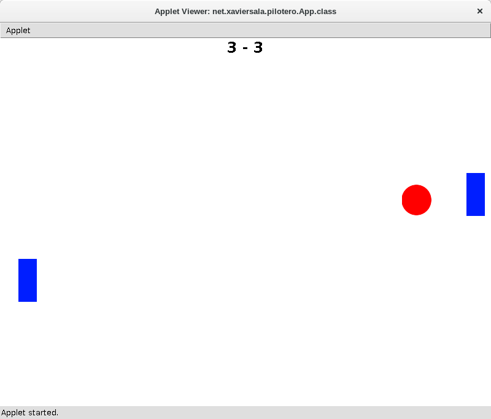

#FpInfor #DawMp03Uf04 #Programació

Programa en Java fent servir la llibreria ACM fet a classe per ensenyar
orientació a objectes als alumnes.

Programa
-------------
Simula el funcionament del clàssic Pong amb dues Pales i una pilota.

S'ha fet interactivament a classe de manera que en alguns punts necessita refactoritzar i pensar si les opcions triades són les millors... 
